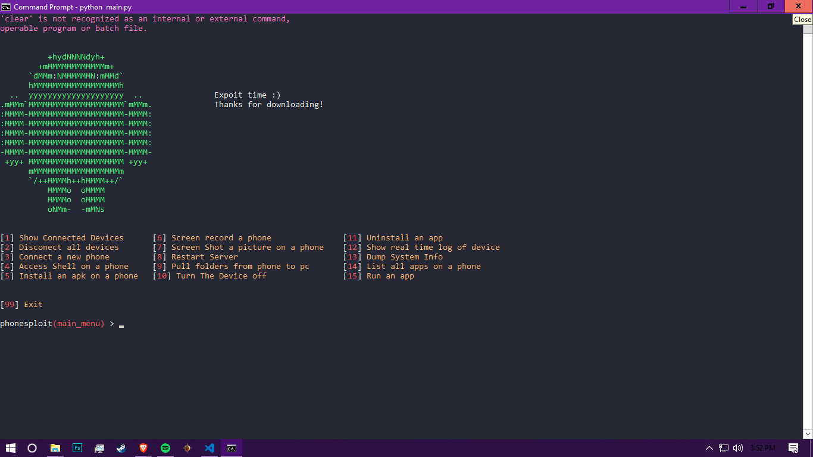

# Recent News (New Update v.1.2)
Port Forwarding<br>        NetStat <br>
Grab wpa_supplicant <br>   Turn WiFi On/Off <br>                
Show Mac/Inet<br>          Remove Password<br>
Extract apk from app<br>   Use Keycode <br>           
Get Battery Status<br>     Get Current Activity<br>   

# PhoneSploit 
Using open Adb ports we can exploit a device
<br>
<br> To find out how to access a local device --> https://www.youtube.com/watch?v=vMzmqmh_Kg4


# HOW TO INSTALL WINDOWS
```
git clone https://github.com/mdkausar295/PhoneSploit2
extract adb.rar to the phonesploit directory 
cd PhoneSploit2
pip install colorama
python2 main.py
```

# HOW TO INSTALL Linux
```
git clone https://github.com/mdkausar295/PhoneSploit2
cd PhoneSploit2
pip install colorama
python2 main_linux.py
```
# IF ADB NOT FOUND
sudo apt update
sudo apt install android-tools-adb android-tools-fastboot


# VIDEO
[](https://www.youtube.com/watch?v=vMzmqmh_Kg4)

# ScreenShots

